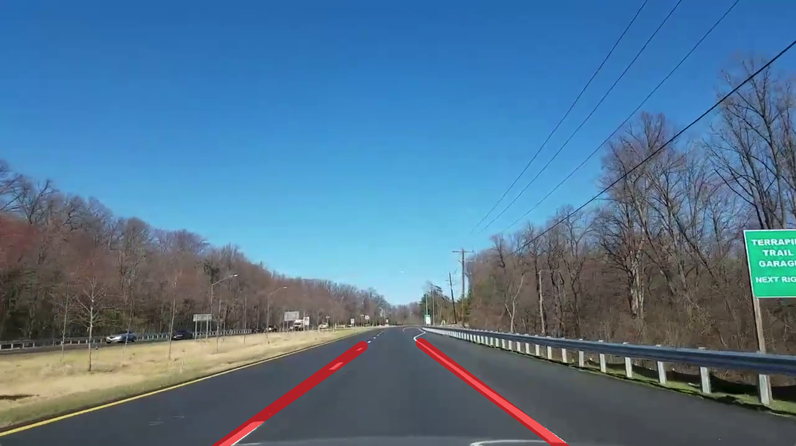

# Python Lane Detection Software

This project is from a mechanical engineering technical elective at the University of Maryland ENME489Y, taught by Steve Michell. This project was used to teach image processing and related topics in python. 

## Technologies Used
- [Python (Version 3.10.9)](https://www.python.org/)
- [Numpy](https://numpy.org/)
- [OpenCv](https://opencv.org/)
- [ImUtils](https://pypi.org/project/imutils/)

## Installation Instructions
Run the pollowing commands inside the lanedetection repo
- Create/Open python shell
- Install numpy packages
- Install imutils packages
- Install OpenCv packages
```
pipenv shell
pip install numpy
pip install imutils
pip install opencv-python
```

## Using Script
Inside the python shell (enter shell with ```pipenv shell```) run
```
python lanedetection_averaging.py
```

This script will open a window that shows the lane detection working on a video of a car driving through College Park, MD. This window will close when the video ends. 

To close the window early press ```q```